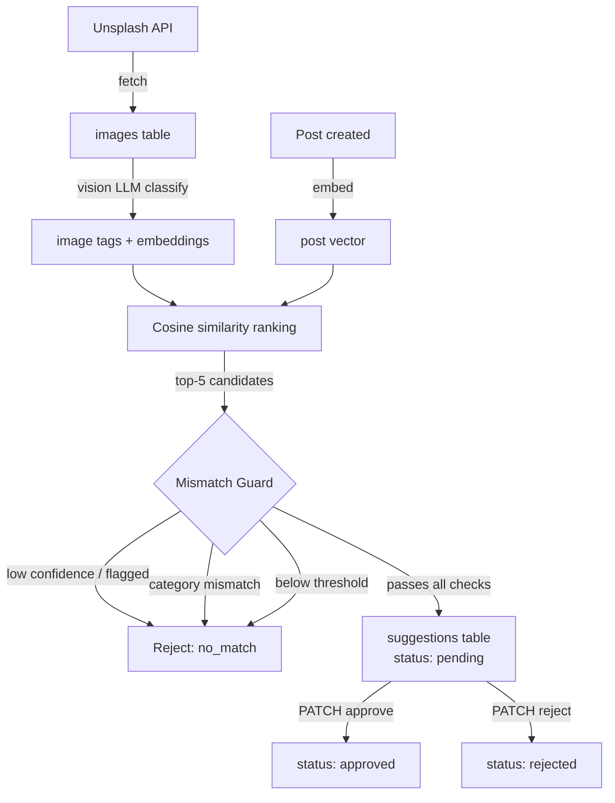

# FlyRank Internship Capstone

Given a library of images and blog posts, the API suggest the correct image for each post based on what the image means. The suggestions are based on a score derived from semantic similarity of the image and the post.

---

## Architecture

> On server startup, images are fetched from Unsplash, tagged with a vision LLM into structured categories, and embedded. Posts are embedded the same way. `posts.service.ts` ranks images against a post by cosine similarity, and `mismatch-guard.ts` rejects candidates that fail confidence or category checks before a suggestion is created.



**Layers:**

- `routes/` → `controllers/` → `services/` → `ai/` / `db` helpers
- Validation at the boundary via Zod (`middleware/validate.ts`)

---

## Getting Started

### Prerequisites

- Node.js
- Docker + docker-compose
- Unsplash API key
- OpenRouter API key

### Run

```bash
cp .env.example .env   # fill in real values
docker-compose up
```

### Seed

```bash
npm run seed # populates posts and evaluation set
```

### Test (optional)

```bash
npm run test
```

---

## Endpoints

| Method | Path                           | Description                                 |
| ------ | ------------------------------ | ------------------------------------------- |
| GET    | `/`                            | Returns API information                     |
| GET    | `/health`                      | Returns API status                          |
| POST   | `/api/posts/`                  | Embeds post and adds it to db               |
| GET    | `/api/posts/:id/images`        | Returns ranked image suggestions for a post |
| GET    | `/api/suggestions/:id`         | Fetch a single suggestion                   |
| PATCH  | `/api/suggestions/:id/approve` | Approve a suggestion                        |
| PATCH  | `/api/suggestions/:id/reject`  | Reject a suggestion                         |
| POST   | `/api/eval`                    | Adds evaluation sets to database            |
| GET    | `/api/eval`                    | Returns precision metric against `eval_set` |

---

## Known Limitations

- The corpus embeddings highly depend on the LLMs understanding of an image. There are images that can be understood by humans but not LLMs.
- The embeddings are limited to the category and the caption, specific attributes which ight be useful for cosine similarity are disregarded.
- Image corpus is fixed to N categories; matching outside these categories will always fall through to `no_match`.

---

## Repo Map

```
src/
  ai/            Vision classification, embeddings, mismatch guard
  db/            Database pool and initializer
  routes/        Route definitions
  controllers/   Request handling, validation wiring
  services/      Business logic (matching, ranking, eval)
  helpers/       Batch jobs, fetch/classify/embed pipelines, cost logging
  middleware/    Run before the controller; mainly input checking
  app.ts         The express app
  config.ts      Contains constants used throught the API
capstone.yaml    Evaluator manifest (run/seed/test/base_url/endpoints)
EVIDENCE.md      Probe-by-probe evidence this system meets the spec
BUILDLOG.md      Development log
DESIGN.md        Design notes
EVIDENCE.md      Contains sample seed and test results
README.md
index.ts         App entry point
.env.example     Sample env vars
docker-compose.yaml
Dockerfile
package.json
package-lock.json
tsconfig.json
```
